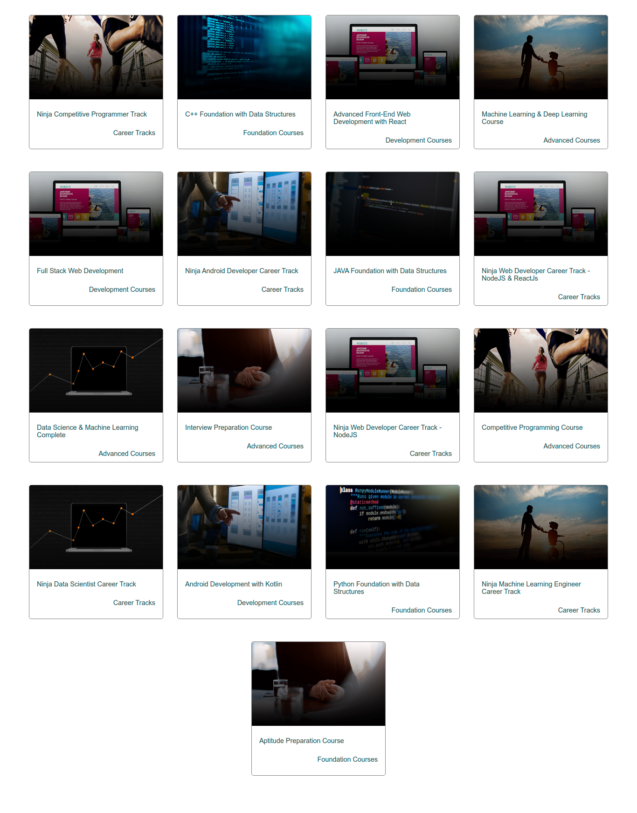

# fetch-courses

- A website to fetch all courses of Coding Ninjas using its API `(https://codingninjas.in/api/v3/courses)`

- The web page initially looks like this 

- After clicking on the button, all the HTML data is removed and the courses are shown on the screen as 
